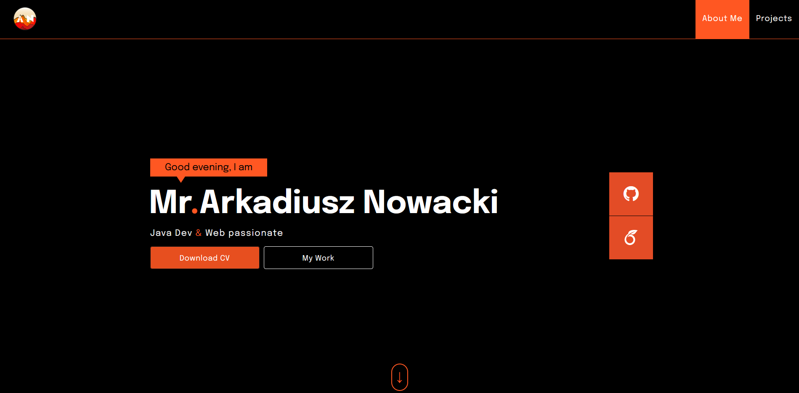
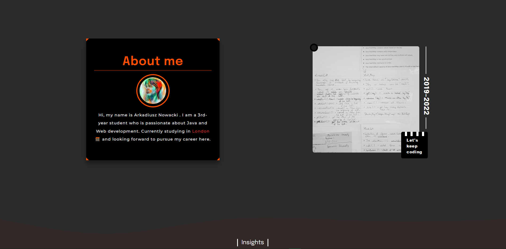
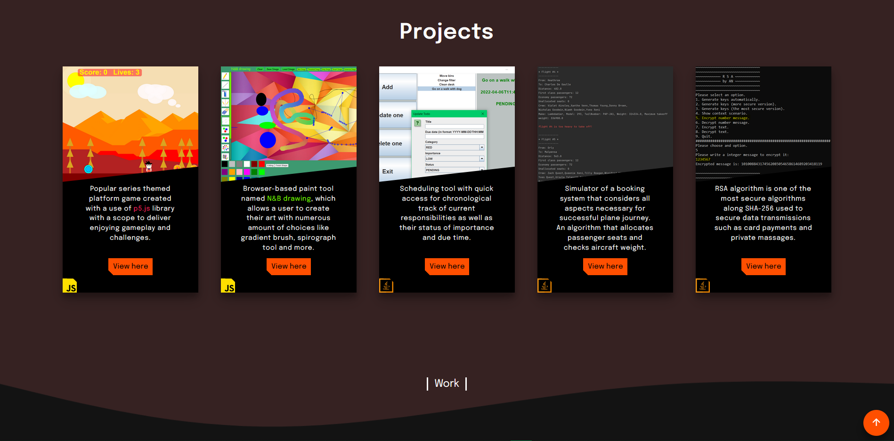
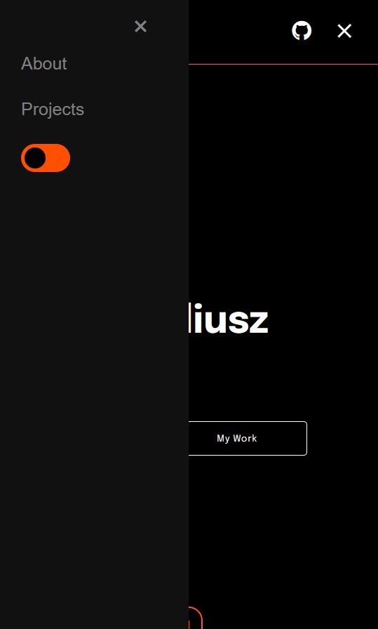

# Portfolio 

**&raquo; Fully responsive website**   _JavaScript_ &middot; _CSS5_ &middot; _HTML5_

---

## About Personal Portfolio 
A portfolio is a fully responsive website that serves as an online business card. The idea for this project was inspired by the Web Development module and my personal interest in familiarizing myself with common web technologies. As a result, it became an opportunity for me to apply the knowledge acquired from my studies and the new books I read during my spare time being:

1. "Responsive Web Design with HTML5 AND CSS (Third Edition)" by Ben Frain.
2. "JavaScript & JQuery interactive front-end web development" by Jon Duckett.

Additionally, I have also utilized various online resources such as W3Schools and the Web Dev Simplified YouTube channel. These resources have allowed me to expand my knowledge beyond the books, which often target older versions of technologies. Instead, I focused on the latest versions, specifically version five of both HTML and CSS, and familiarized myself with their new features.

#### Contents
- **[1 About the website](#2-about-the-website)**
- **[2 Results](#2-results)**
  - [2.1 Home section](#21-home-section)
  - [2.2 About section](#22-about-section)
  - [2.3 Project section](#23-project-section)
  - [2.4 Phone version](#24-phone-version)

## 1 About the website
The website is...

[[Top 🢁](#contents)]

## 2 Results

### 2.1 Home section
The Home section provides users with access to my GitHub account, where they can explore a wide range of available projects. Additionally, visitors can download my CV or directly access examples of my previous work. Currently, there is a button featuring the Overleaf logo, which will redirect users to my written works (currently under development).

### 2.2 About section
This section provides additional details about me, and it will be continuously updated to include all my achievements.

### 2.3 Project section
The Projects section showcases examples of my work to date, emphasizing my skills in various technology stacks, including Java, JavaScript, HTML5, CSS5, and more.

### 2.4 Phone version
To ensure optimal viewing across a wide range of devices, a phone version of the portfolio was created, catering to various screen sizes. The menu has been replaced with a hamburger button, which appears on the left side, providing navigation to different sections. Additionally, a feature has been implemented to adjust the page color for better readability at night. Lastly, there is a button available that allows users to quickly navigate to the top of the page for seamless browsing.

[[Top 🢁](#contents)]

